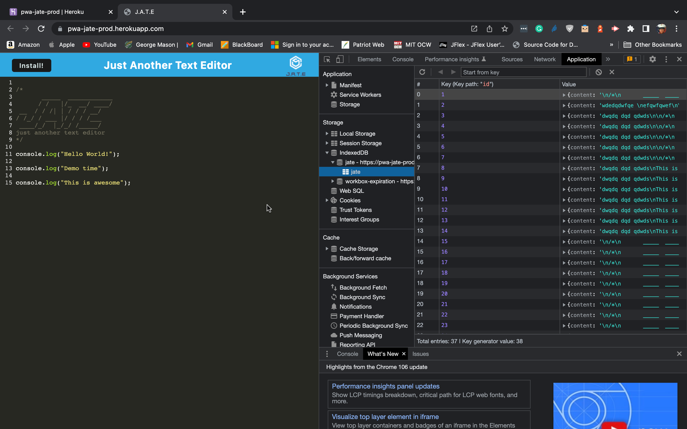

# pwa-text-editor

## Description
The challenge is to build an API for a social network web application where users can share their thoughts, react to friends’ thoughts, and create a friend list. Using Express.js for routing, a MongoDB database, and the Mongoose ODM. In addition to using the Express.js

## Application Demo

The following image shows the application's manifest.json file:

The following image shows the application's registered service worker:

The following image shows the application's IndexedDB storage:

This walkthrough video shows JATE:
* typing notes
* Open the notes and add new text that will appear on a new jate app
* Here's a link to the recorded video: https://watch.screencastify.com/v/2IBqoVcWFHRbRRlcRIlD

## Table of Contents
  - [Description](#description)
  - [Application Demo](#application-demo)
  - [Table of Contents](#table-of-contents)
  - [User Story](#user-story)
  - [Acceptance Criteria](#acceptance-criteria)
  - [Installation](#installation)
  - [Usage](#usage)
  - [Contributing](#contributing)
  - [Questions](#questions)

## User Story
* AS A developer
* I WANT to create notes or code snippets with or without an internet connection
* SO THAT I can reliably retrieve them for later use

## Acceptance Criteria
* GIVEN a text editor web application
* WHEN I open my application in my editor
* THEN I should see a client-server folder structure
* WHEN I run `npm start` from the root directory
* THEN I find that my application should start up the back end and serve the client
* WHEN I run the text editor application from my terminal
* THEN I find that my JavaScript files have been bundled using webpack
* WHEN I run my webpack plugins
* THEN I find that I have a generated HTML file, service worker, and a manifest file
* WHEN I use next-gen JavaScript in my application
* THEN I find that the text editor still functions in the browser without errors
* WHEN I open the text editor
* THEN I find that IndexedDB has immediately created a database storage
* WHEN I enter content and subsequently click off of the DOM window
* THEN I find that the content in the text editor has been saved with IndexedDB
* WHEN I reopen the text editor after closing it
* THEN I find that the content in the text editor has been retrieved from our IndexedDB database
* WHEN I click on the Install button
* THEN I download my web application as an icon on my desktop
* WHEN I load my web application
* THEN I should have a registered service worker using Workbox
* WHEN I register a service worker
* THEN I should have my static assets precached upon loading along with subsequent pages and static assets
* WHEN I deploy to Heroku
* THEN I should have proper build scripts for a webpack application

## Installation
* Open the command line terminal and go to the proper directory
* Clone the git repo from :octocat: [kea6t](https://github.com/kea6t)
* Then type npm init to install dependencies
* Then npm i express
* Then npm install and npm run build on client directory
* Then enter: "npm run dev" on root directory to launch the app 🚀
* Then open localhost:8080 to see app 

## Usage
* See the live version of the app here [JATE](https://pwa-jate-prod.herokuapp.com/)

## Contributing
:octocat: [kea6t](https://github.com/kea6t)

This was generated with ❤️ made by Kenny 🔥🌌🌳🦝🚀

## Questions
If you have any questions :grey_question:, please send me an email at: :e-mail: Email me with any questions: keasay26@gmail.com
